# Microsoft Surface Laptop 3 13.5吋 開箱與評測

## 前言

自從Surface Laptop 3的消息洩漏我就已經開始期待，當微軟在[2019/10/02的直播](https://youtu.be/dmaioTs0NH8)上發表時，原本3:2的螢幕就很吸引我，再加上這次的更新有搭配全金屬機身的配色、Mini DP換成USB-C等改善，我就決定我下一台筆電非它莫屬了。台灣大約在11月中開放預購，由於我想要延長保固，一般通路賣的家用版是沒辦法延長保固的，只能享有1年的有限保固，因此我就去赫普電腦訂購了商務版，商務版一律比家用版貴了NT$3200，差異是15吋的機種也用Intel的CPU，系統由Windows 10 Home升級至Pro。

這次開箱的配置為（只列出可選配置，如果需要完整配置，可以參考[官網](https://www.microsoft.com/zh-tw/surface/devices/surface-laptop-3?activetab=techspecs)）：

- CPU⸺Intel Core i5-1035G7
- RAM⸺8GB LPDDR4x 3733MHz
- SSD⸺256GB M.2 PCIe
- 外表⸺13.5吋、沙岩色與金屬手腕支撐墊

因為我喜歡13.5吋才有的沙岩色和全金屬，我也不需要太大的螢幕，所以我選了13.5吋，續航力也比15吋的高（因為兩者的電池容量一樣），性能和容量我也不需要太高，但容量128GB的版本只有白金色而且不是全金屬，因此決定了這樣的配置。如果是家用版的話這個配置是NT\$41888，不過我買的是商務版，因此售價是NT\$45088，再加上延長保固至3年（多2年）的費用NT$2599，我總共花了NT\$47687在上面。

原本台灣預計是2019/12/04就會上市，但在快到發售日時發現[PChome 24h購物](https://24h.pchome.com.tw/)上Surface Laptop 3的預購頁面突然沒了，並找到了[這一篇](https://www.mobile01.com/topicdetail.php?f=743&t=5967053)才知道要延期發售。爬了一些文並詢問了赫普電腦，得知原因是Intel 10nm處理器缺貨和商檢或BSMI認證沒有過，並說預計2020年首季上市。延了大概3個月多，這期間我也有想過要不要換其他的但最後還是決定等下去，終於在2020/02/07發售，赫普電腦於10號幫我寄出，隔天拿到後就開始準備了這篇開箱文，直到今天（15號）才完成。順帶一提，台灣上市拖了那麼久，還沒有延期的補償方案（至少商務版沒有），香港方面卻在2019/12/23就上市了。

## 開箱

赫普電腦透過新航快遞將筆電寄過來，箱子上還有信封裝有發票。

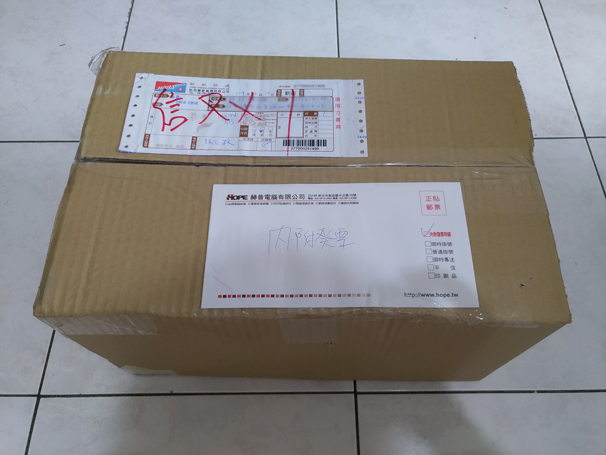

拆箱後先來看贈品，有桌曆、保溫杯、印有Microsoft Surface標誌與字樣的後背包和配件包。失望的是並沒有因延期發售而補償的贈品，隨後我也去問了赫普電腦，他們向微軟確認之後，確定不會有。

原本以為這個盒子裡面應該還有實際筆電的盒子，因為看起來很簡陋，不是一般白色包裝也沒有印筆電的圖樣，但沒想到這個就是筆電的外盒。這次好像只要是商務版的外盒都這樣簡陋。

打開盒子後可以看到用不織布袋包裹住的筆電本體，先取出來放旁邊等等再看。

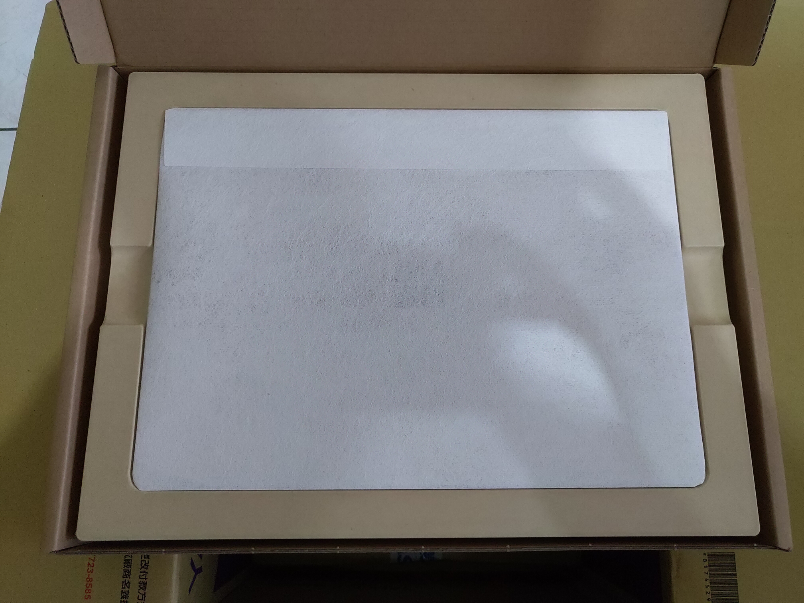

取出筆電本體後，可以發現有一張紙，正面印有這台筆電的圖，顏色也是匹配的。

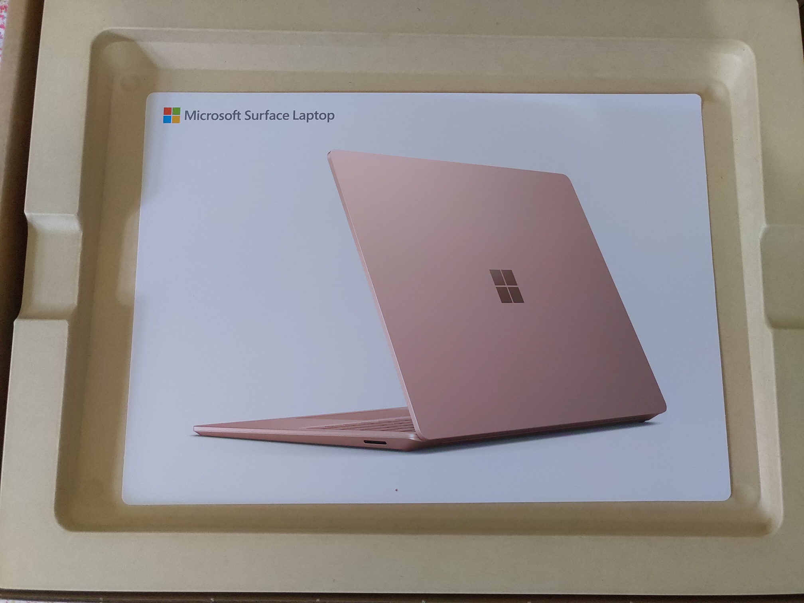

紙的背面描述了這台的系統為Windows 10 Pro並僅供商業及教育客戶使用，鍵盤配置為繁體中文。

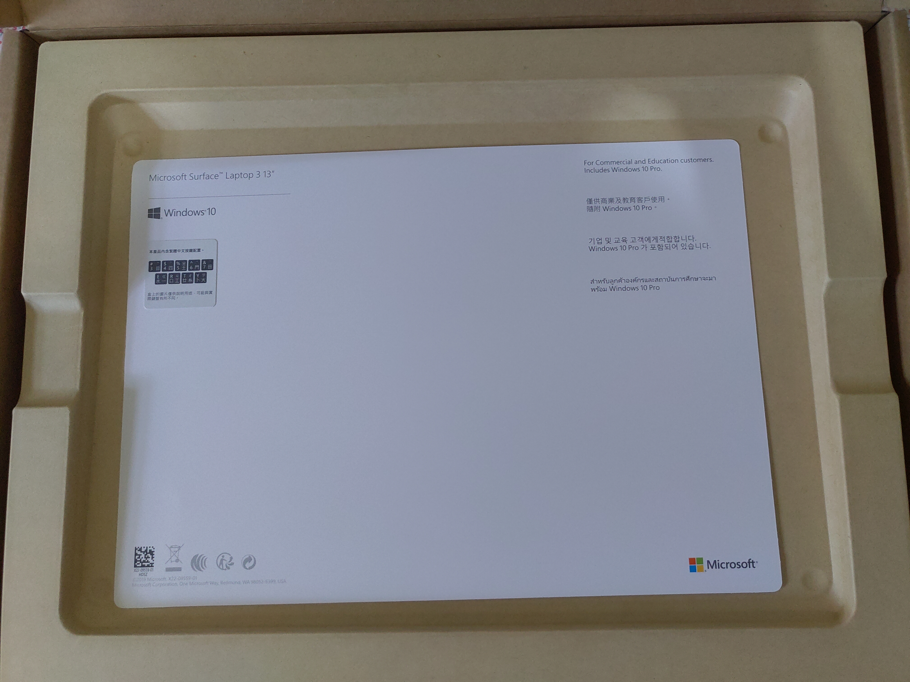

拿開紙，可以看到有小紙盒和長紙盒。

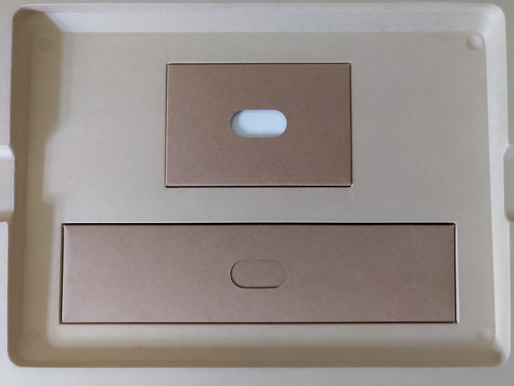

小紙盒內包含了說明書、Windows 10應用程式說明、安全和法規指南等。

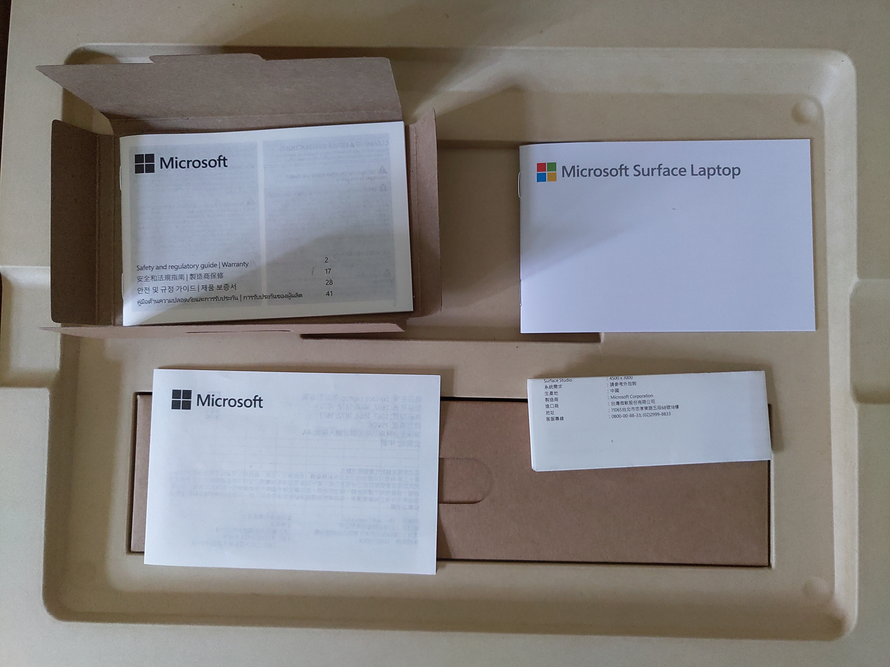

長紙盒內裝了1個包含Surface Connect連接埠和1個USB-A的充電器。

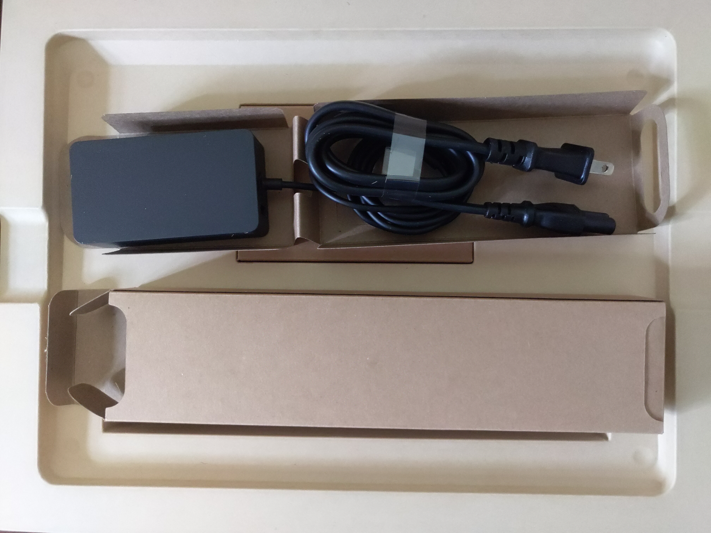

隨附的電源為65W，規格為：

- 交流輸入⸺100-240V~1.6A, 50/60Hz
- 直流輸出⸺15V⎓4A（Surface Connect連接埠）、5V⎓1A（USB-A，只能充電無法資料傳輸）

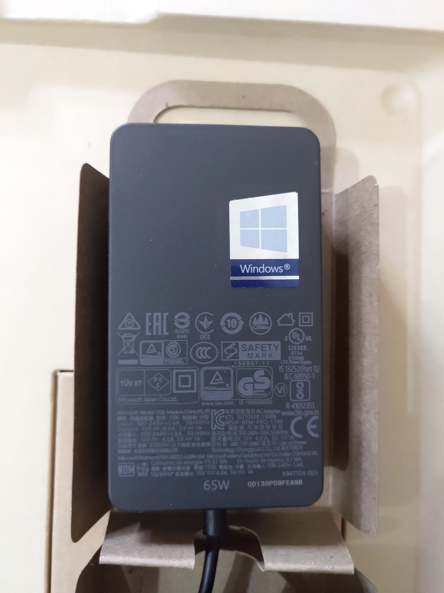

回來看筆電本體，不織布袋的口沒有用膠黏死，可以重複使用。拿出來之後可以看到不論是質感還是做工都超級棒，甚至比Macbook Pro還要美。

A面只有微軟的標誌，不同於霧面的外殼，標誌是亮面的。D面也是非常的乾淨，只有4個膠墊和正前方一些淡淡的字，沒有任何散熱孔，整台筆電的散熱孔位在後方（與D面上文字的地方相鄰，我沒有拍出來），但也不會因為螢幕打開時被擋到。詳細可以參考[iFixit的拆解影片](https://youtu.be/OpXizbzeRoc)。

連接埠方面，左側配有1個USB 3.0 Type-A（5 Gbps）、USB 3.1 Gen2 Type-C（10 Gbps）和3.5mm耳麥孔；右側則有1個磁吸式Surface Connect連接埠，可以用來充電或搭配天價的[Surface擴充基座](https://24h.pchome.com.tw/prod/DHAY0X-19008J99R)進行的擴充。在前兩代中，USB-C的位置是Mini DP，這代改用USB-C無疑是非常大的改進，再加上支援[視訊輸出](https://answers.microsoft.com/en-us/surface/forum/all/surface-laptop-3-displayport-output/0f1208b4-64f8-4cf1-80b9-55bf0635932d)和60W PD充電，因此不需要原廠的充電器，可直接用一般支援PD的行充或旅充充電，但遺憾的是不支援Thunderbolt 3，因此無法進行更高速的傳輸和外接顯示卡。

因為上蓋的寬度比主機多出一點，即使沒有像Macbook系列一樣在觸控板下有凹槽，也很容易單手打開螢幕，打開時非常輕鬆不會很卡，另外即使嘗試用力蓋上螢幕，在螢幕闔上的一瞬間感覺到的卻是輕輕的蓋上，發出舒服的聲音。

B面為一整塊玻璃，包含了3:2的鏡面螢幕，螢幕的邊框大約1.1cm（上、左、右）和1.5cm（下至C面）厚，以現在的標準來說算粗了。螢幕上方配有2孔麥克風、720p彩色相機和用於Windows Hello的紅外線相機，當彩色相機運作時會亮白燈，紅外線相機運作時會亮紅燈，臉部辨識的速度非常快速。螢幕是可以觸控的，但在觸控時螢幕會回彈沒有很穩定，建議可以一隻手扶著螢幕再觸控。

雖然看電影等情況3:2這比例會有比16:9更大的黑邊，但非常適合瀏覽網頁、文書處理工作和寫程式等，比起16:9它可以看到更多的垂直內容，也就是同時看到更多行的文字，提高了一定的生產力，但特殊規格的螢幕也是造成這台筆電高價的原因之一。

關於這螢幕的色域、色准和亮度我沒有專業儀器去測，但參考[Windows Central的評測](https://www.windowscentral.com/surface-laptop-3-13-review)，色域涵蓋97% sRGB、72% AdobeRGB和75% DCI-P3，亮度為3.8至400尼特，雖然色域不高，但因亮面且亮度不低，也足夠漂亮了，不過反光算嚴重。這螢幕的HDR的支援沒有很完善，支援播放HDR影片但不支援HDR應用程式和遊戲。

C面上沒有任何貼紙，非常乾淨，有著印有繁體中文標籤的剪刀腳鍵盤，打起來蠻舒服的而且聲音不大。鍵盤右上角是Del鍵而電源鍵在Del鍵左側，防止要按Del鍵時勿觸電源鍵。鍵盤可調4段背光（包含不亮）而且很少漏光。還有尺寸約11.5×7.7cm的觸控板，完整支援Windows 10的手勢，觸感可以說是Windows筆電裡面最好的，和Macbook Air/Pro系列有的比，不過和大部分的Windows筆電一樣，越是靠近鍵盤的位置越難按下，這部分就比不上了。整台筆電的喇叭直接藏在螢幕的下方，雖然我沒有儀器測具體來說有多少分貝，但是音量很大而且音質也很不錯。

經過實際抓著B面兩側進行前後擺動，可以感覺得出來非常得堅固，要施一定的力才能擺出形變；C面也是，實際按壓也無法輕鬆地按壓下去，由此可見這台筆電的堅固程度和Macbook Air/Pro系列有的比了。

## 評測

開機、設置好並進入桌面，系統的確為Pro版本，而且Windows 10的版本是最新的1909。因為商務版的關係，預裝了Office 365專業增強版和Microsoft Teams，但因為我自己擁有的Office 365是個人版，也用不到Microsoft Teams，所以都把它們砍了。

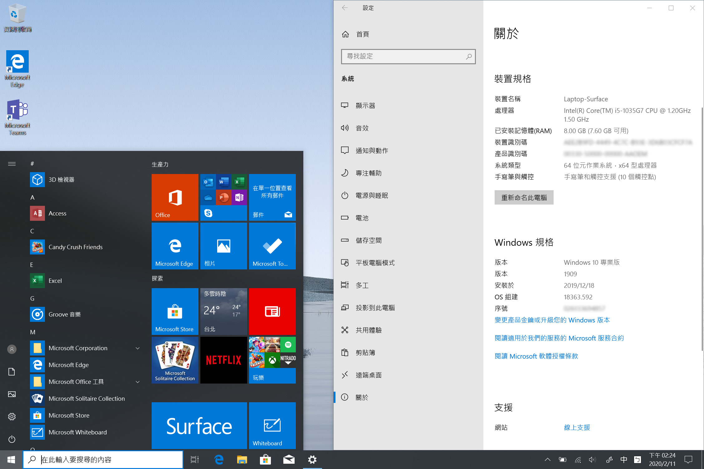

進入磁碟管理，可以看到256GB的SSD在Windows顯示的容量為238.35GB，切了3個磁區，分別為「EFI」、「C槽」和「Windows RE tools」，其中C槽為237.24GB，已經由BitLocker加密，但因為我不需要所以就給它解密了。

因為2256×1504這個解析度實在太奇葩，而且在預設縮放150%時，對於不支援高解析度的程式來說解析度不為整數，因此我認為2250×1500會更加合適。在這台筆電自訂解析度不需要任何非官方的軟體，直接從Microsoft Store安裝[Intel顯示晶片控制中心](https://www.microsoft.com/p/intel-graphics-command-center/9plfnlnt3g5g)，自訂解析度並將比例從「延展」改為「置中」，成功套用後沒有任何異常發生，也幾乎看不出來邊框有變得更粗。

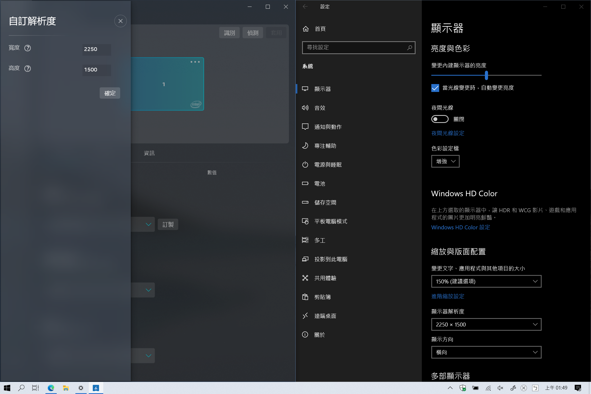

但由於縮放為150%並非整數，一部分不支援高解析度的應用程式打開時，會有模糊的狀況發生，雖然可以透過「覆寫應用程式的縮放比例行為」來改善，但結果不一定能和支援高解析度的應用程式一樣銳利，多少還是有些模糊，而縮放如果是200%之類的就會非常舒服（我桌機的螢幕就是這個縮放比例），完全不會有模糊的狀況發生，即使沒有額外覆寫縮放比例行為，頂多就是維持鋸齒（也就是顯示效果和低解析度螢幕差不多），因此如果這台解析度跟13.5吋的Surface Book一樣是3000×2000（267PPI）的話，預設縮放將會是200%，可以大幅改善這個問題。

接著，將系統和驅動全部更新到最新後，正式開始評測。有關於硬體規格等圖裡都有就不詳細闡述了。

### CPU-Z

首先是CPU-Z，記憶體和GPU沒有辦法完整辨識，簡單跑了下單執行續和多執行續的測試分數。

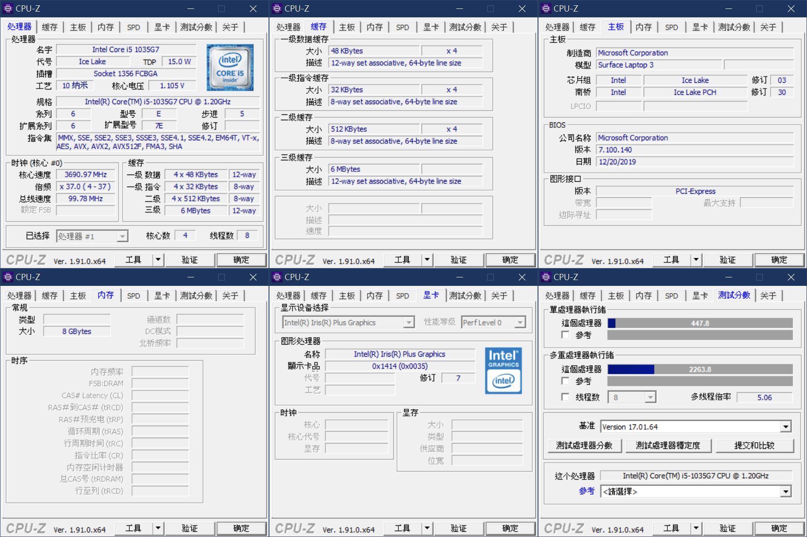

### GPU-Z

GPU-Z上能完整辨識到GPU。

### CrystalDiskMark 7

在CrystalDiskMark 7跑了3種不同設定檔的測試，由上到下分別為「預設」、「最佳效能」和「真實世界效能」。可以看出雖然這PCIe SSD是M.2 2230的而不是M.2 2280，但表現仍然不錯。

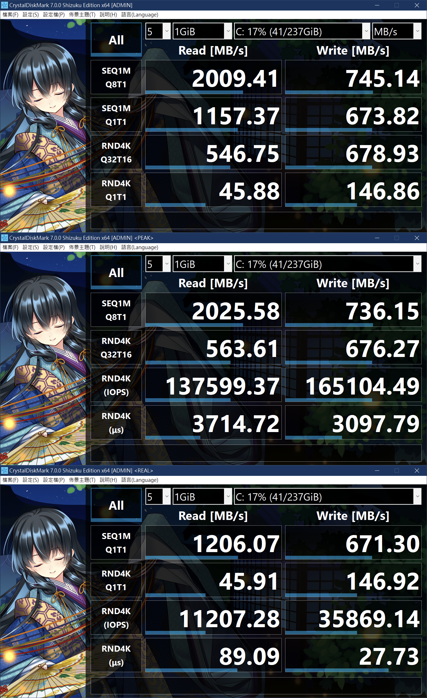

### AS SSD Benchmark

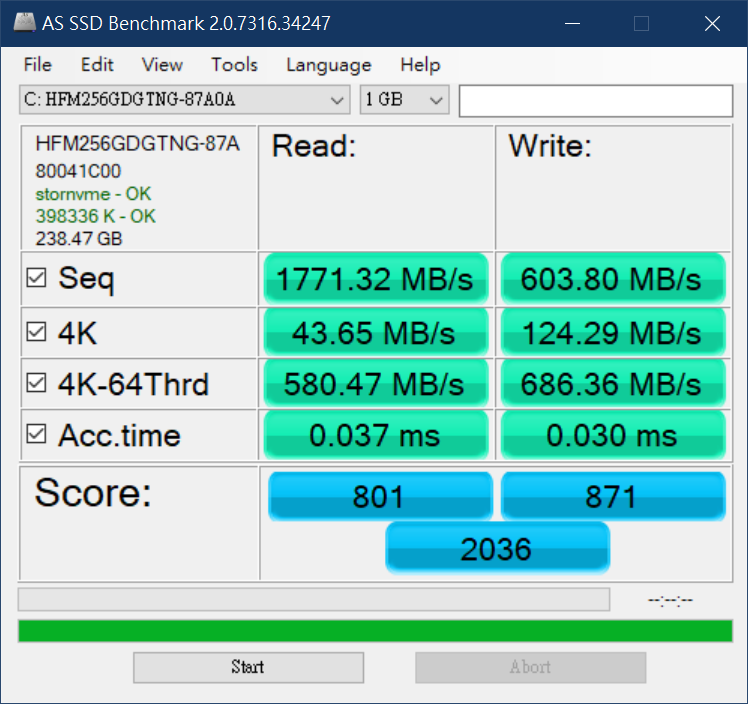

### ATTO Disk Benchmark

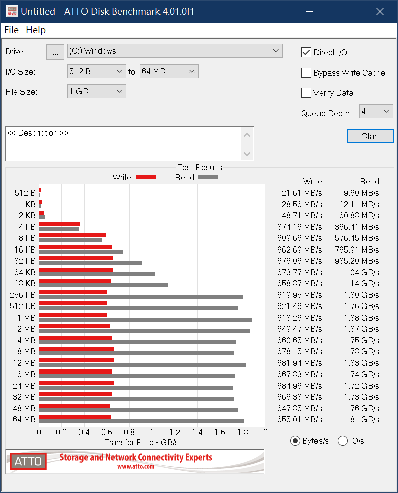

### HD Tune Pro

在跑HD Tune Pro時，由於「效能測試」和「隨機存取」的「寫入」部分必須要在硬碟未掛載的狀態下才能跑，但是因為它是系統碟無法直接卸載，所以我就忽略不跑了（也是有辦法測但比較麻煩就是了）。

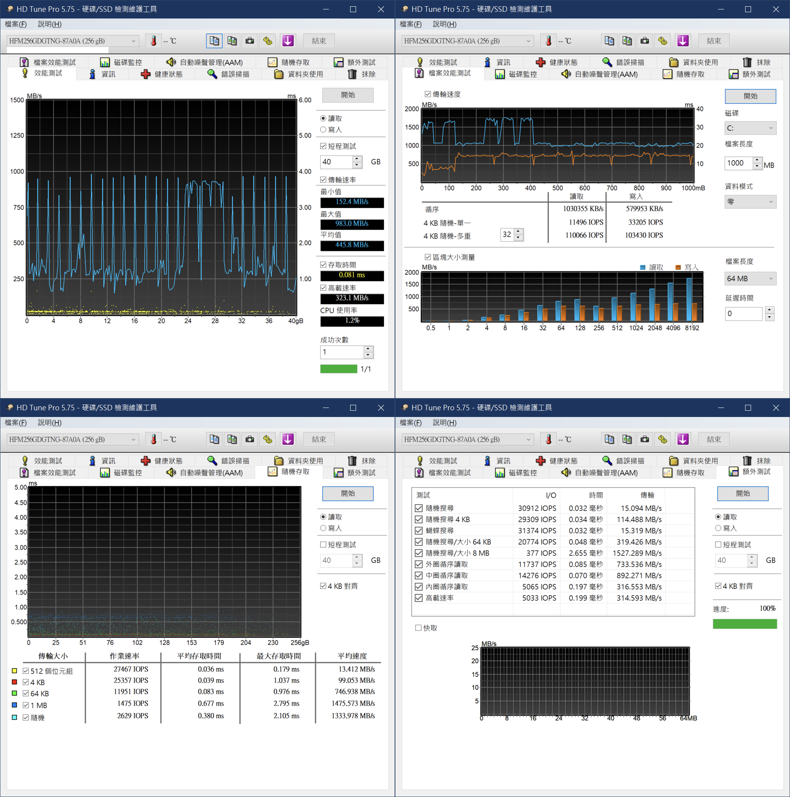

### Cinebench R15

由於不是所有的評測都有Cinebench R20的成績，由其是在Cinebench R20推出以前的評測也不會特別去更新，所以就順便跑了一下Cinebench R15，方便跟舊硬體比較，雖然用過時的軟體來測不一定能發揮新硬體的所有實力。

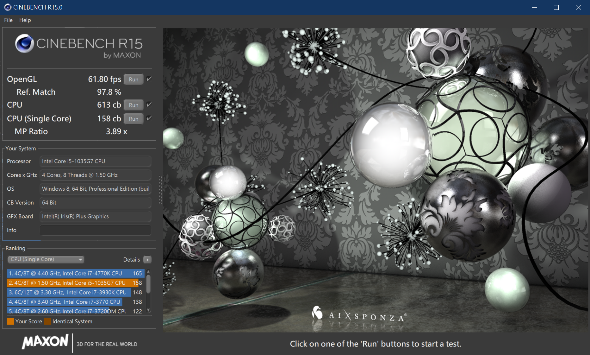

### Cinebench R20

可惜Cinebench R20沒有OpenGL的測試。

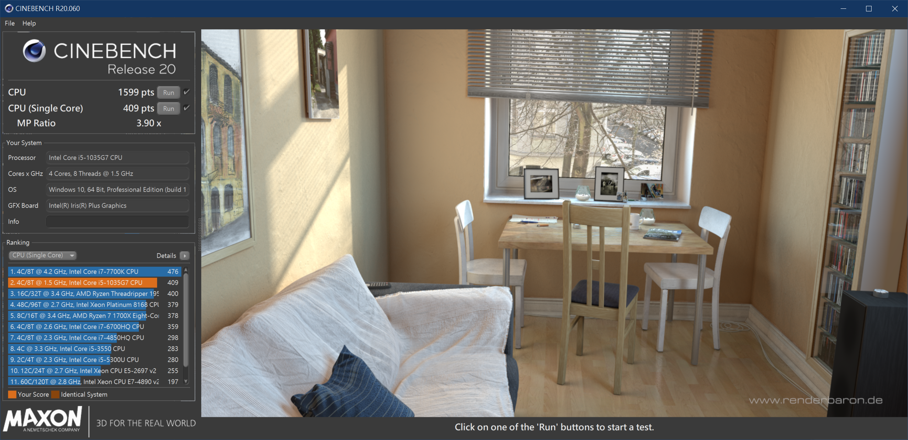

### Geekbench 4

和Cinebench R15一樣的理由，我也跑了Geekbench 4。成績如下：

- [CPU](https://browser.geekbench.com/v4/cpu/15219476)⸺5119分（單核心）、17438分（多核心）
- [GPU（OpenCL）](https://browser.geekbench.com/v4/compute/4725421)⸺37449分

詳細數據可以點進以上連結查看。

### Geekbench 5

成績如下：

- [CPU](https://browser.geekbench.com/v5/cpu/1199225)⸺1154分（單核心）、4424分（多核心）
- [GPU（OpenCL）](https://browser.geekbench.com/v5/compute/516023)⸺10198分
- [GPU（Vulkan）](https://browser.geekbench.com/v5/compute/516031)⸺7209分

詳細數據可以點進以上連結查看。

### 3DMark

跑完後出現「顯卡驅動未獲批准」的警告，所以不知道這結果正不正常就是了。成績如下：

- [Time Spy](https://www.3dmark.com/3dm/43839823)⸺801分
- [Fire Strike](https://www.3dmark.com/3dm/43840486)⸺2221分
- [Night Raid](https://www.3dmark.com/3dm/43840704)⸺7690分
- [Sky Diver](https://www.3dmark.com/3dm/43840944)⸺7479分

詳細數據可以點進以上連結查看。

### PCMark 10

只有跑PCMark 10的主要測試（Demo版只能跑那個），成績為4174分，詳細數據可以在[這裡](https://www.3dmark.com/pcm10/43841613)查看。

### AIDA64

跑AIDA64的快取與記憶體測試時，它寫記憶體的種類是雙通道的LPDDR4-2133，但是實際上記憶體的頻率應該是3733MHz才對，工作管理員也是寫3733MHz，處理器i5-1035G7也是直接支援LPDDR4-3733不需超頻。

跑了8分鐘AIDA64的系統壓力測試，一開始CPU的待機溫度約40到50℃，開始燒機時溫度會先突然飆到90℃然後穩定在65到75℃左右運行，C面的溫度也只是溫溫的而已。從飆到90℃這邊開始偵測到降頻（圖中是0%但是經過多次測試最高有到3%），雖然i5-1035G7可以超到3.7GHz但溫度穩定後頻率維持在不超頻的1.2GHz左右，也從溫度穩定後開始聽到明顯的風扇聲，並不刺耳尚可接受。

### Prime95

CPU的待機溫度約40到50℃，和AIDA64差不多，一開始Prime95跑時溫度會先飆至90℃一下，然後穩定在60到70℃左右運行。

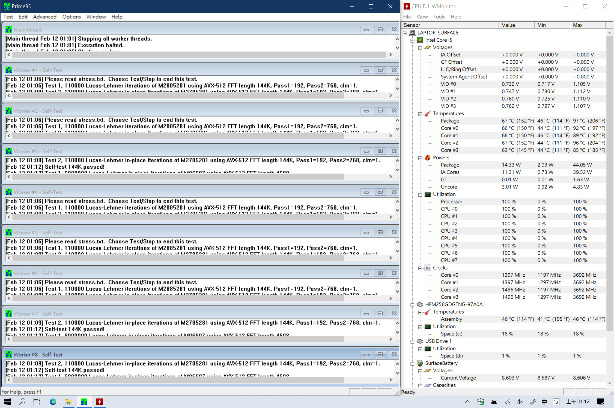

## 總結

綜合以上結果，這是一台非常棒的筆電，不只外觀漂亮又堅固，喇叭優異，性能表現也是非常優秀，即使在高負載的狀況下也只會有溫溫的感覺，噪音也在可接受的範圍內。但不足的地方還是有的，特殊規格的螢幕、漂亮的外表和堅固的機身等種種因素讓它擺脫不了高價的命運，尷尬的螢幕解析度，還有雖然從上代的Mini DP改成USB-C值得肯定，但是在這個價位卻不支援Thunderbolt 3，這對一些需要高速傳輸或想要嘗試外接顯卡的人無疑是一個致命傷。

如果原本就不在意什麼CP值，除了性能以外也會把外觀、做工和使用體驗等部分納入考量，且著重在文書處理和程式開發等相關工作的話，那我會非常推薦這一台。

我的評測到此告一段落。最後，為了保護筆電外表刮傷等，我有直接拿去[Ezstick](http://www.ezstick.com.tw/)做貼膜。由於在這之前他們沒有這台筆電型號的膜，我的筆電借他們做開發，我原本以為他們的[新機器方案](https://imgur.com/a/FjKBn71)裡所描述的「免費幫您貼」只是免除代貼費用，結果完全免費，真的是賺到了，在他們的[Facebook專頁中的演示影片](https://www.facebook.com/permalink.php?story_fbid=3869278996445877&id=404384099602068)中出現的筆電就是我借他們的。

他們的機身膜雖然是透明的但是還是有格狀的紋路用來透氣，雖然我不清楚是透什麼氣不過紋路並不明顯，筆電外表從原本的霧面質感變成了亮面，但還是很漂亮。雖然影片中給我的筆電貼了霧面的螢幕貼，但是因為我在先前就要求說我想要亮面的玻璃貼，所以實際上我最後拿到的是貼玻璃貼的，雖然並沒有非常合B面，左右側內縮了約3mm，但螢幕能正常閉合所以我並沒有介意，不過老闆在貼之前也跟我說了因為玻璃貼較難施工，Surface Laptop用的只剩2片也不會再進貨了。另外因為觸控板的部分膜雖然不影響功能，但很影響手感，尤其是原本的觸感實在是太棒，所以我還是把觸控板上的膜給撕了，建議店家針對觸控板的貼膜可以開發具有磨砂感的。 
